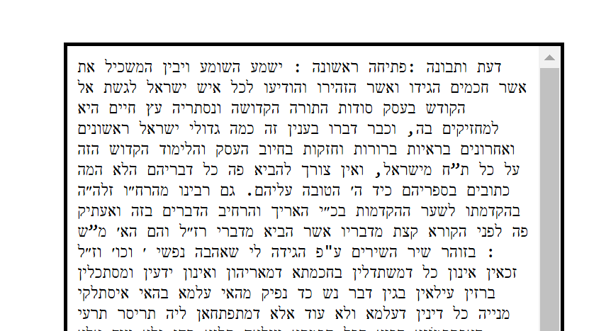
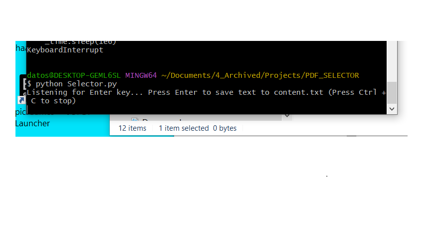
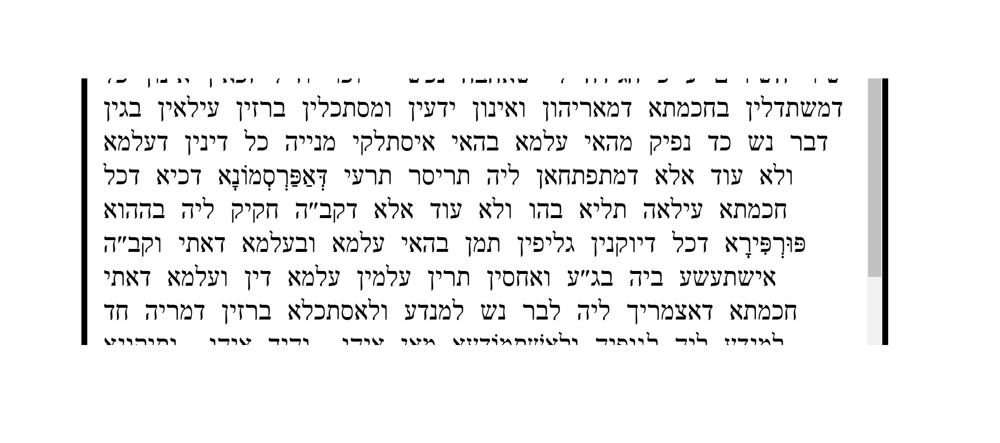
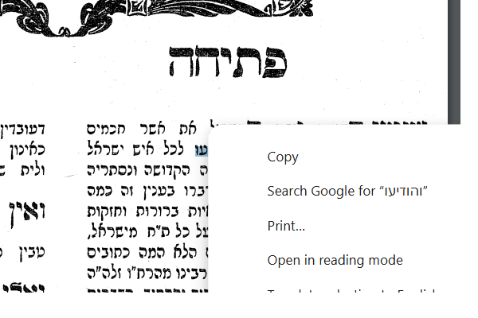
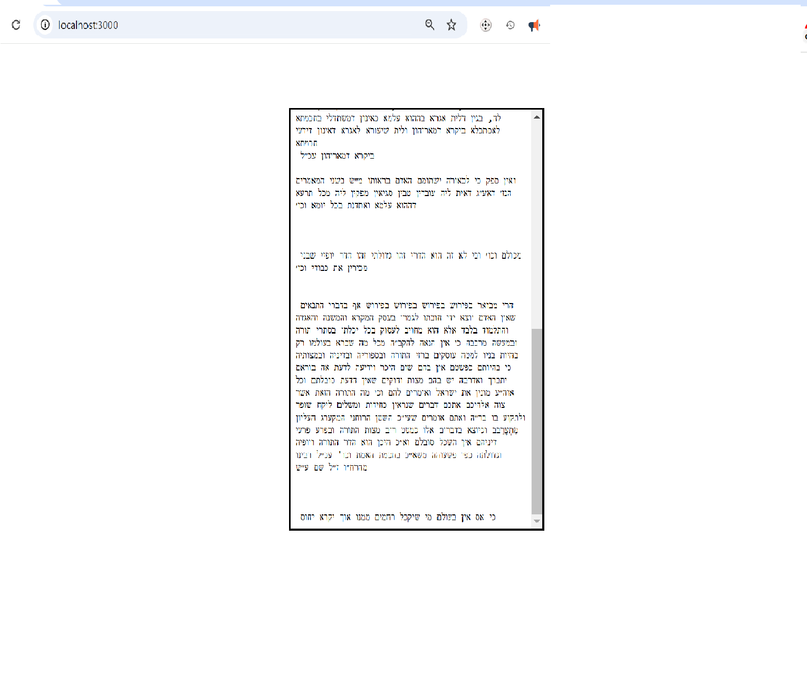

Besiata DeShmaya בְּסִיַּעְתָּא דִּשְׁמַיָּא,

## **Abstract**





**This project is a PDF text selection tool that takes advantage of browser-based PDF viewers to extract, edit, and manipulate text. Modern web browsers can recognize ASCII text and even roughly pick up specialized scripts like Rashi script in PDFs. This application builds on that capability, allowing users to select text, automatically insert it into an interactive HTML editor, and make quick modifications.**

**Additionally, the extracted text can be seamlessly transferred into translation models or LLMs such as ChatGPT, Claude, or Perplexity AI for interlinear translation or further processing. This tool is particularly valuable for researchers, students, and professionals working with historical manuscripts or multilingual texts.**



<details>
  <summary><strong> Getting to Know This Project 🔍 </strong></summary>

From what it seems, most PDF viewers have an ability to pick up ASCII text from PDF Documents. It seems even most can pick up the famous and illustrious **Rashi script** from PDFs as well, as shown in the picture below.



Select any of the words from the PDF document, and you will see the text registered in the selection space, as shown in the picture above.

Now, this application allows you, once you have selected the text, to press **Enter** on any selection, and it will automatically add the word into an **interactive HTML editor**, as seen in the image below.



**Summary**

Overall this allows for **easy editing** and is great for **rendering old manuscripts into selectable form**. (Meaning, in order to copy or paste the text later if needed, or to send the overall text into any **translation model or LLM** like ChatGPT, Claude, or Perplexity AI that supports interlinear translation.) 

This is a very useful application because it allows for **quick text modifications** using the program and saves the output into a **persistent file on the system**.

</details>


<details> 
<summary>Compatabillity </summary>

BROWSERS THAT PICK UP PDF TEXT STREAMS ON SELECTING TEXT
CHROME 
BRAVE
MICROSOFT EDGE 

BROWSERS THAT THE PDF SELECTOR WILL ACCEPT 
CHROME
BRAVE 
MICROSOFT EDGE - TEXT IS REVERSED

RECOMENDED FOR USE 
CHROME OR BRAVE


</details>


<details> 
   <summary><strong>Prerequisites and Requirements 🛠️ </strong></summary>

To use this tool, make sure you have the following installed:

✅ **A Browser with PDF Viewing Capabilities** – The program should recognize any browser-based PDF viewer.  
   **Recommended:** [Google Chrome](https://www.google.com/chrome/) for best compatibility.  

✅ **Node.js** – Required for running the backend.  
   📥 [Download Node.js](https://nodejs.org/)  

✅ **Python** – Required for additional processing.  
   📥 [Download Python](https://www.python.org/)  

✅ **A PDF Document** – A PDF file containing selectable text to test the application's functionality.

</details>


 <summary><strong>User Guide - Instructions & Getting Started 🚀 </strong></summary>

**Tutorial** 

To run the program, clone the repository and start the local server using:

```sh
node server.js
