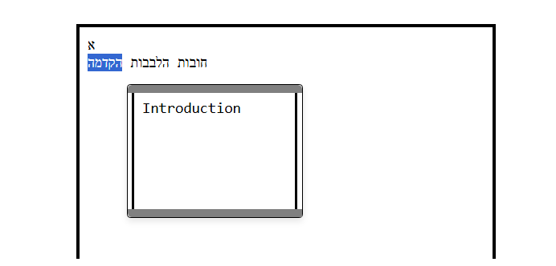
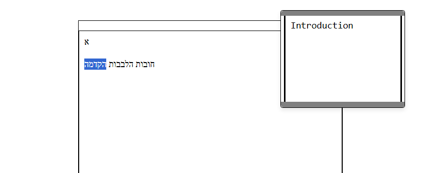
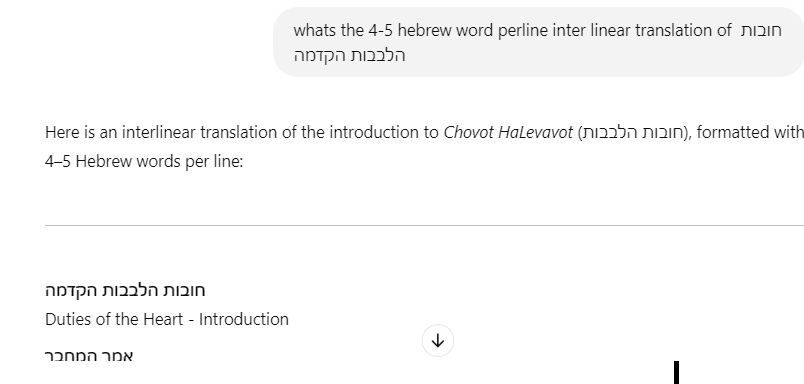

**Besiata DeShmaya בְּסִיַּעְתָּא דִּשְׁמַיָּא**

## **📜 PDF SELECTOR**

 ## 📜 About This Project
**This project is a PDF text selection tool that enhances the browser-based PDF viewing experience and allows users to also extract, edit, and process text. Popular web browsers like Chrome, Brave, and Microsoft Edge can recognize ASCII text and even roughly detect specialized scripts like Rashi script in PDFs. This application builds on that capability, allowing users to:**

  - **Select text from PDFs.**
  - **Automatically insert it into an interactive HTML editor.**
  - **Make quick modifications for further use.**
  - **Allow for seamless transfer of extracted text into translation models or Large Language Models (LLMs) such as ChatGPT, Claude, or Perplexity AI for interlinear translation or additional processing.**
  - **This tool is particularly useful for researchers, students, and professionals working with historical manuscripts or multilingual texts, especially in Hebrew.**

  

  
<strong>🔍 Getting to Know the Project </strong>

  
**Modern PDF viewers, such as those in Chrome and Brave, have the ability to detect ASCII text from PDFs. They can even roughly recognize the famous Rashi script and convert it into standard Ashuri Script/Standard ASCII by default as shown in the picture below.**

**Select any of the words from the PDF document, and you will see the text registered in the selection space in standard Ashuri Script/Standard ASCII form, as shown in the picture above.**

**Now, this application allows you, once you have selected the text, to press **Enter** on any selection, and it will automatically add the word into an **interactive HTML editor**, as seen in the image below. You can then select, view, cut, copy, paste, add, and delete text and even save notes on selected words and retrieve the same notes upon selecting the same word again and pressing the key combination again.**

**Overall this allows for easy editing and is great for rendering old manuscripts into selectable form. Once in selectable form this means that after the selection the text can  easily be copied or pasted into any other application, or sent into any large translation model or language model, such as ChatGPT, Claude, or Perplexity AI, that supports interlinear translation.**

**This is a very useful middle man in-between like application because it allows for quick text modifications using the program and saves the output into a persistent file on the system upon toggeling save.**

  
<strong>🌍Compatibility</strong>

### Browsers That Pick Up PDF Text Streams on Selecting Text:
- **Chrome**  
- **Brave**  
- **Microsoft Edge**  

### Browsers That the PDF Selector Will Accept:
- **Chrome**  
- **Brave**  
- **Microsoft Edge** (Text is reversed, though)  

### Recommended for Use:
- **Chrome**  
- **Brave**  

 
   
<strong>🛠️ Prerequisites and Requirements  </strong>

**To use this tool, make sure you have the following installed:**

✅ **A Browser with PDF Viewing Capabilities** – The program should recognize any browser-based PDF viewer that picks up PDF TEXT STREAMS ON SELECT.  
   **Recommended:** [Google Chrome](https://www.google.com/chrome/) or [Brave Browser](https://brave.com/download/)) for best compatibility.  

✅ **Node.js** – Required for running the backend.  
   📥 [Download Node.js](https://nodejs.org/)  

✅ **Python** – Required for uploading selections into the browser app via "Enter" keyboard/shortcut binding.  
   📥 [Download Python](https://www.python.org/)  

✅ **A PDF Document** – A PDF file containing selectable text to test the application's functionality.

 
<strong>🚀 User Guide - Instructions & Getting Started  </strong>

**To run the program, clone the repository and start the local server using:**

`node server.js`

**The output should look something like this.**

**Once you have run the command go to your webbrowser (Perferably Chrome or Brave) and write localhost:3000 this should load the editor as in the picture below.**

 

**Holding down shift and pressing Enter will toggle the editor to go into Edit Mode where you can cut, select, copy, paste, write, and delete the text inside the editor.**

 

**Holding shift and pressing enter again will toggle the editor into preview mode where it is easy to view the over all text. Text selection and copy is also available.**

 

**Now once the program is running on the web browser run `python Selector.py` for Windows and `sudo python3 SelectorAppleDevice.py` if your on Apple Mac in your Terminal/ClientShell of choice as in the picture bellow.**

**You can now go and start selecting text from your pdfs of choice and press enter and it will add the text into the web application.**

**To make things easier first clear the existing text by first pressing shift enter to toggle into edit mode and replace the existing text for now with just a single character as in the picture bellow.** 

**Because if you leave nothing in the box and toggle save by togglling into Preview mode by holding shift and pressing enter and you then refresh the page all the text you deleted will come right back because the program does not support replacing the previous text with empty space. If you want to clear and start from new you have to at least leave a single character. Later you can delete it though by replaceing it with more text or what ever you want.** 

**So to test uploading your PDF Selections into the browser app. Open your pdf, run `python Selector.py`, select some text, press enter and that should load the selected text into the browser app and you should see the text inside the input section/box after you press refreash.** 

**Another important functionality is the tooltip/note that you can save onto selected text and view from selected text upon holding shift and pressing space.**

**Select the text you want to make a note on hold shift and press space to toggle the note to show up and write some stuff into the box once you want to save the note select the same text or if the text is already selected by the text selector just hold down shift and press space to save the note onto the selected text. The note will automatically close upon holding shift and pressing sapce** 

**You can also Drag the note when toggleing the note to show up by holding shift and pressing enter and when you toggle it to show up next time it will be aproximatly in the same spot you left it after you hit toggle save onto the selected text.** 

 <strong> 💡 Example Prompt For ChatGPT and AI </strong>

 
**Happy Editing and Happy Translating!**

**Example prompt for interlinear translation of final edited text using ChatGPT**

    

