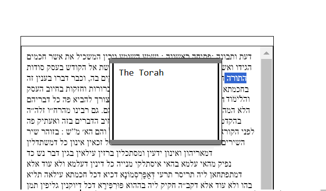

Besiata DeShmaya בְּסִיַּעְתָּא דִּשְׁמַיָּא,

## **Abstract**

**This project is a PDF text selection tool that takes advantage of browser-based PDF viewers to extract, edit, and manipulate text. Modern web browsers can recognize ASCII text and even roughly pick up specialized scripts like Rashi script in PDFs. This application builds on that capability, allowing users to select text, automatically insert it into an interactive HTML editor, and make quick modifications.**

**Additionally, the extracted text can be seamlessly transferred into large translation models or large language model such as ChatGPT, Claude, or Perplexity AI for interlinear translation or further processing. This tool is particularly valuable for researchers, students, and professionals working with historical manuscripts or multilingual texts especially in the Hebrew language.**

  

  
<strong> Getting to Know This Project 🔍 </strong>

**PDF viewers especially like the ones in Chrome and Brave have an ability to pick up ASCII text from PDF Documents. They can even roughly and pretty accurately here and there pick up even the famous and illustrious **Rashi script** from PDFs as well and by defualt convert it into Ashuri Script/Standard ASCII , as shown in the picture below.**

**Select any of the words from the PDF document, and you will see the text registered in the selection space in standard Ashuri Script/Standard ASCII form, as shown in the picture above.**

**Now, this application allows you, once you have selected the text, to press **Enter** on any selection, and it will automatically add the word into an **interactive HTML editor**, as seen in the image below. You can then select, view, cut, copy, paste, add, and delete text and even save notes on selected words and retrieve the same notes upon selecting the same word again and pressing the key combination again.**

**Summary**

**Overall this allows for **easy editing** and is great for **rendering old manuscripts into selectable form**. (Meaning, in order to copy or paste the text later if needed into another application, or to send the overall text into any **translation model or LLM** like ChatGPT, Claude, or Perplexity AI that supports interlinear translation.)**

**This is a very useful middle man in-between like application because it allows for **quick text modifications** using the program and saves the output into a **persistent file on the system** also upon save.**

  
<strong>Compatibility</strong>

### Browsers That Pick Up PDF Text Streams on Selecting Text:
- **Chrome**  
- **Brave**  
- **Microsoft Edge**  

### Browsers That the PDF Selector Will Accept:
- **Chrome**  
- **Brave**  
- **Microsoft Edge** (Text is reversed, though)  

### Recommended for Use:
- **Chrome**  
- **Brave**  

 
   
<strong>Prerequisites and Requirements 🛠️ </strong>

**To use this tool, make sure you have the following installed:**

✅ **A Browser with PDF Viewing Capabilities** – The program should recognize any browser-based PDF viewer.  
   **Recommended:** [Google Chrome](https://www.google.com/chrome/) or [Brave Browser](https://brave.com/download/)) for best compatibility.  

✅ **Node.js** – Required for running the backend.  
   📥 [Download Node.js](https://nodejs.org/)  

✅ **Python** – Required for additional processing.  
   📥 [Download Python](https://www.python.org/)  

✅ **A PDF Document** – A PDF file containing selectable text to test the application's functionality.

 
<strong>User Guide - Instructions & Getting Started 🚀 </strong>

**Tutorial** 

**To run the program, clone the repository and start the local server using:**

`node server.js`

**The output should look something like this.**

**Once you have run the command go to your webbrowser (Perferably Chrome or Brave) and write localhost:3000 this should load the editor as in the picture below..**

 

**Holding down shift and pressing Enter will toggle the editor in Edit Mode where you can copy, paste, write, and delete the text inside the editor.**

 

**Holding shift and pressing enter again will toggle the editor into preview mode where it is easy to view the over all text**

 

**Now once the program is running on the web browser run `python Selector.py` in your Terminal/ClientShell of choice as in the picture bellow.**

**You can now go and start selecting text from your pdfs of choice and press enter and it will add the text into the web application.**

**To make things easier first clear the existing text by first pressing shift enter to toggle into edit mode and replace the existing text for now with just a single character as in the picture bellow.** 

**Because if you leave nothing in the box and toggle save by togglling into Preview mode by holding shift and pressing enter and you then refresh the page all the text you deleted will come right back because the program does not support replace the previous text with empty space. If you want to clear and start from new you have to leave a single character. Later you can delete it though.** 

**So to test you loading your PDF Selections into the browser app. Open your pdf, run `python Selector.py`, select some text, press enter and that should load the selected text into the browser app when you press refreash** 

